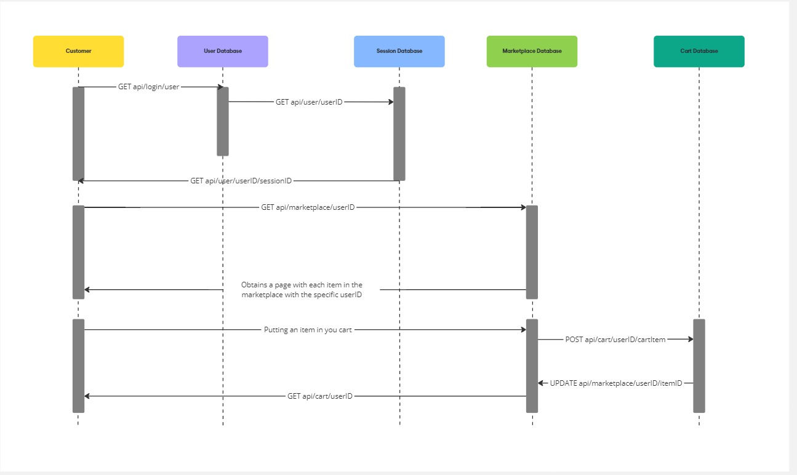

# Entities and their attributes owned by your team

## 1. User

The **User** entity stores information about individuals or companies who use the platform.

- **User**
  - id (UUID): Primary key, unique identifier for each user.
  - name (VARCHAR): Name of the user (individual or company).
  - email (VARCHAR): Unique email address for each user.
  - password (VARCHAR): Encrypted password for the user.
  - created_at (TIMESTAMP): Timestamp when the user was created.
  - updated_at (TIMESTAMP): Timestamp when the user information was last updated.

## 2. BankAccount

The **BankAccount** entity stores details about a user's linked bank accounts.

- **BankAccount**
  - id (UUID): Primary key, unique identifier for each bank account.
  - iban (VARCHAR): International Bank Account Number (IBAN) for the account.
  - swift (VARCHAR): SWIFT/BIC code of the bank.
  - bank_name (VARCHAR): Name of the bank.
  - account_holder (VARCHAR): Name of the account holder.
  - user_id (UUID): Foreign key that references `User(id)`.
  - created_at (TIMESTAMP): Timestamp when the bank account was created.
  - updated_at (TIMESTAMP): Timestamp when the bank account details were last updated.

## 3. Portfolio

The **Portfolio** entity stores details about the user's holdings of different assets.

- **Portfolio**
  - id (UUID): Primary key, unique identifier for each portfolio.
  - asset_type (VARCHAR): Type of asset in the portfolio (e.g., stock, bond, cryptocurrency).
  - quantity (DECIMAL): Quantity of the asset held in the portfolio.
  - current_price (DECIMAL): Current price of the asset in the market.
  - user_id (UUID): Foreign key that references `User(id)`.
  - created_at (TIMESTAMP): Timestamp when the portfolio was created.
  - updated_at (TIMESTAMP): Timestamp when the portfolio was last updated.

## 4. Trade

The **Trade** entity stores information about individual trades executed by users.

- **Trade**
  - id (UUID): Primary key, unique identifier for each trade.
  - transaction_id (UUID): Unique identifier for each transaction.
  - user_id (UUID): Foreign key that references `User(id)`.
  - portfolio_id (UUID): Foreign key that references `Portfolio(id)`.
  - trade_type (ENUM): Type of trade ('buy' or 'sell').
  - asset_type (VARCHAR): Type of asset being traded (e.g., stock, bond, cryptocurrency).
  - quantity (DECIMAL): Quantity of the asset being traded.
  - price (DECIMAL): Price at which the asset is being traded.
  - status (ENUM): Status of the trade ('pending', 'executed', 'canceled', 'failed', 'settled').
  - created_at (TIMESTAMP): Timestamp when the trade was created.
  - updated_at (TIMESTAMP): Timestamp when the trade was last updated.

## 5. TransactionHistory

The **TransactionHistory** entity stores a record of all transactions.

- **TransactionHistory**
  - id (UUID): Primary key, unique identifier for each transaction history record.
  - trade_id (UUID): Foreign key that references `Trade(id)`.
  - status_change (ENUM): Indicates the change in trade status ('pending', 'executed', 'canceled', 'failed', 'settled').
  - change_timestamp (TIMESTAMP): Timestamp when the status change occurred.

## 6. Settlement

The **Settlement** entity stores information about the settlements for completed trades.

- **Settlement**
  - id (UUID): Primary key, unique identifier for each settlement record.
  - trade_id (UUID): Foreign key that references `Trade(id)`.
  - settlement_date (TIMESTAMP): Date when the trade was settled.
  - settlement_amount (DECIMAL): Amount involved in the settlement.
  - settlement_currency (VARCHAR): Currency of the settlement.
  - bank_account_id (UUID): Foreign key that references `BankAccount(id)`.
  - created_at (TIMESTAMP): Timestamp when the settlement was created.

# API documentation (contract only) that your team owns


# Test cases for testing above APIs
This section explains the test file structure for validating the database schema, models, and associations based on an Entity-Relationship Diagram (ERD). The tests cover **CRUD operations**, **model associations**, **validation tests**, and **error handling** for the ```User```, ```BankAccount```, ```Portfolio``` and ```Trade``` models.
## Acceptance Criteria
The test cases follow the acceptance criteria below:
1. Unit tests cover all CRUD operations for the ```User```, ```BankAccount```, ```Portfolio``` and ```Trade``` models.
2. Association tests ensure correct relationships and foreign keys between models.
3. Validation tests confirm that model constraints (unique, format, enum) are enforced.
4. Error handling is tested and provides meaningful feedback for invalid operations.
5. All tests pass without issues, and the relationships in the ERD are accurately reflected in the data models.
## Test File Structure
The test file (```api.test.js```) is structured into several sections:
### 1. CRUD Operations Test
This section tests the basic create, read, update, and delete (CRUD) operations for the ```User```, ```BankAccount```, ```Portfolio``` and ```Trade``` models.
- **Create Operation**: Tests for creating a new user, bank account, portfolio, and trade.
- **Read Operation**: Tests fetching a user along with their associated bank accounts and portfolios.
- **Update Operation**: Tests updating the balance of a bank account.
- **Delete Operation**: Tests deleting a trade.
### 2. Association Tests
This section ensures that the association between the models are correctly defined based on the ERD and verifies the following:
- A ```User``` can have many ```BankAccounts```.
- A ```Portfolio``` belongs to a ```User```.
- A ```Portfolio``` can have many ```Trades```.
### 3. Validation Tests
This section verifies that the model validations and constraints are correctly enforced. Tests include:
- Ensuring that a ```User``` cannot be created with an invalid email format.
- Ensuring that the ```User``` email must be unique.
### 4. Error Handling Tests
This section tests how the application handles errors for invalid operations. Tests include:
- Trying to create a ```BankAccount``` without a valid ```User``` ID.
- Attempting to update a non-existent ```User```.

# APIs that your stories will need, but will be provided by other teams
Market Data API:
- For real-time market data, including prices and trends for various assets.
- Features: Price feeds, historical data, market summaries.

Portfolio Management API:
- To provide insights and management tools for users' investment portfolios.
- Features: Portfolio valuation, performance metrics, asset allocation analysis.

Reporting API:
- For generating reports on trades, settlements, and account activities.
- Features: Daily/weekly summaries, transaction reports, audit logs.

Settlement API:
- For managing the settlement process of trades.
- Features: Initiate settlements, retrieve settlement status, confirm settlement completion.

# What stories from your backlog are being worked upon 
- [Issue #35](https://github.com/dhruvilk/CS673/issues/35)
- [Issue #2](https://github.com/dhruvilk/CS673/issues/2)
- [Issue #36](https://github.com/dhruvilk/CS673/issues/36)
- [Issue #37](https://github.com/dhruvilk/CS673/issues/37)

# Make sure that you include the pivotal tracker link where you are showing all your agile artifacts.
- [Project link](https://github.com/users/dhruvilk/projects/1/views/1?pane=issue&itemId=82301405)