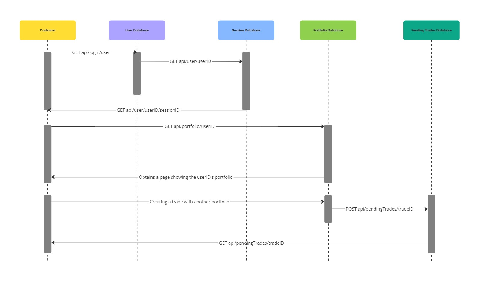

# Entities and their attributes owned by your team

## 1. User

The **User** entity stores information about individuals or companies who use the platform.

- **User**
  - id (UUID): Primary key, unique identifier for each user.
  - name (VARCHAR): Name of the user (individual or company).
  - email (VARCHAR): Unique email address for each user.
  - password (VARCHAR): Encrypted password for the user.
  - created_at (TIMESTAMP): Timestamp when the user was created.
  - updated_at (TIMESTAMP): Timestamp when the user information was last updated.

## 2. BankAccount

The **BankAccount** entity stores details about a user's linked bank accounts.

- **BankAccount**
  - id (UUID): Primary key, unique identifier for each bank account.
  - iban (VARCHAR): International Bank Account Number (IBAN) for the account.
  - swift (VARCHAR): SWIFT/BIC code of the bank.
  - bank_name (VARCHAR): Name of the bank.
  - account_holder (VARCHAR): Name of the account holder.
  - user_id (UUID): Foreign key that references `User(id)`.
  - created_at (TIMESTAMP): Timestamp when the bank account was created.
  - updated_at (TIMESTAMP): Timestamp when the bank account details were last updated.

## 3. Portfolio

The **Portfolio** entity stores details about the user's holdings of different assets.

- **Portfolio**
  - id (UUID): Primary key, unique identifier for each portfolio.
  - asset_type (VARCHAR): Type of asset in the portfolio (e.g., stock, bond, cryptocurrency).
  - quantity (DECIMAL): Quantity of the asset held in the portfolio.
  - current_price (DECIMAL): Current price of the asset in the market.
  - user_id (UUID): Foreign key that references `User(id)`.
  - created_at (TIMESTAMP): Timestamp when the portfolio was created.
  - updated_at (TIMESTAMP): Timestamp when the portfolio was last updated.

## 4. Trade

The **Trade** entity stores information about individual trades executed by users.

- **Trade**
  - id (UUID): Primary key, unique identifier for each trade.
  - transaction_id (UUID): Unique identifier for each transaction.
  - user_id (UUID): Foreign key that references `User(id)`.
  - portfolio_id (UUID): Foreign key that references `Portfolio(id)`.
  - trade_type (ENUM): Type of trade ('buy' or 'sell').
  - asset_type (VARCHAR): Type of asset being traded (e.g., stock, bond, cryptocurrency).
  - quantity (DECIMAL): Quantity of the asset being traded.
  - price (DECIMAL): Price at which the asset is being traded.
  - status (ENUM): Status of the trade ('pending', 'executed', 'canceled', 'failed', 'settled').
  - created_at (TIMESTAMP): Timestamp when the trade was created.
  - updated_at (TIMESTAMP): Timestamp when the trade was last updated.

## 5. TransactionHistory

The **TransactionHistory** entity stores a record of all transactions.

- **TransactionHistory**
  - id (UUID): Primary key, unique identifier for each transaction history record.
  - trade_id (UUID): Foreign key that references `Trade(id)`.
  - status_change (ENUM): Indicates the change in trade status ('pending', 'executed', 'canceled', 'failed', 'settled').
  - change_timestamp (TIMESTAMP): Timestamp when the status change occurred.

## 6. Settlement

The **Settlement** entity stores information about the settlements for completed trades.

- **Settlement**
  - id (UUID): Primary key, unique identifier for each settlement record.
  - trade_id (UUID): Foreign key that references `Trade(id)`.
  - settlement_date (TIMESTAMP): Date when the trade was settled.
  - settlement_amount (DECIMAL): Amount involved in the settlement.
  - settlement_currency (VARCHAR): Currency of the settlement.
  - bank_account_id (UUID): Foreign key that references `BankAccount(id)`.
  - created_at (TIMESTAMP): Timestamp when the settlement was created.

# API documentation (contract only) that your team owns

# Test cases for testing above APIs

# APIs that your stories will need, but will be provided by other teams
Market Data API:
- For real-time market data, including prices and trends for various assets.
- Features: Price feeds, historical data, market summaries.

Portfolio Management API:
- To provide insights and management tools for users' investment portfolios.
- Features: Portfolio valuation, performance metrics, asset allocation analysis.

Reporting API:
- For generating reports on trades, settlements, and account activities.
- Features: Daily/weekly summaries, transaction reports, audit logs.

Settlement API:
- For managing the settlement process of trades.
- Features: Initiate settlements, retrieve settlement status, confirm settlement completion.

# What stories from your backlog are being worked upon 
- [Issue #35](https://github.com/dhruvilk/CS673/issues/35)
- [Issue #2](https://github.com/dhruvilk/CS673/issues/2)
- [Issue #36](https://github.com/dhruvilk/CS673/issues/36)
- [Issue #37](https://github.com/dhruvilk/CS673/issues/37)

# Make sure that you include the pivotal tracker link where you are showing all your agile artifacts.
- [Project link](https://github.com/users/dhruvilk/projects/1/views/1?pane=issue&itemId=82301405)